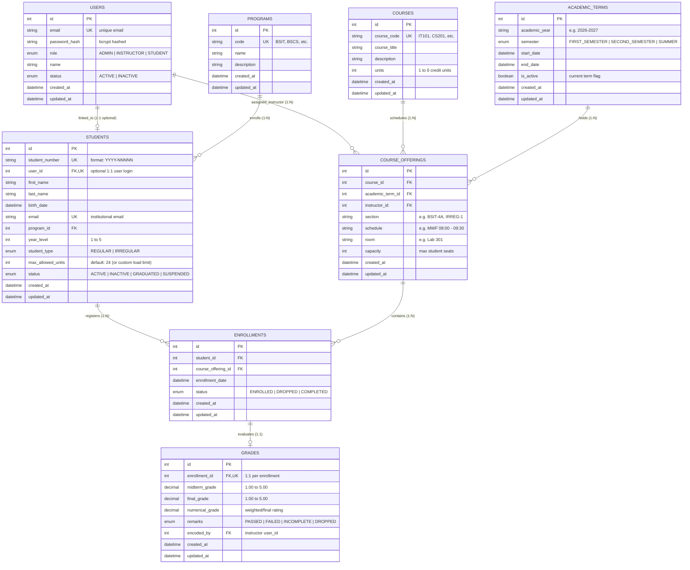

# Relational Entity-Relationship Diagram (ERD)

## Student Information Management System (SIMS) REST API

This document details the relational database schema implemented in **PostgreSQL 18** via **Prisma ORM** for Laboratory Activity 2. The schema is normalized to Third Normal Form (3NF) to ensure data integrity, prevent duplicate records, and enforce institutional academic policies.

---

## 1. Mermaid Entity-Relationship Diagram

---

## 2. Table Specifications & Integrity Constraints

### 2.1 Users (`users`)
- **Primary Key:** `id` (Serial/Auto-increment).
- **Unique Indexes:** `email` (Case-insensitive unique login identifier).
- **Indexes:** `idx_users_role_status` (`role`, `status`) for role-based authorization filtering.
- **Relations:**
  - One-to-one optional relation with `students` via `students.user_id`.
  - One-to-many relation with `course_offerings` where `role = 'INSTRUCTOR'`.

### 2.2 Programs (`programs`)
- **Primary Key:** `id`.
- **Unique Indexes:** `code` (e.g., `BSIT`, `BSCS`, `BSIS`).
- **Relations:** One-to-many with `students`.

### 2.3 Courses (`courses`)
- **Primary Key:** `id`.
- **Unique Indexes:** `course_code` (e.g., `IT101`, `CS201`).
- **Validation Constraints:** `units` between 1 and 6.
- **Relations:** One-to-many with `course_offerings`.

### 2.4 Academic Terms (`academic_terms`)
- **Primary Key:** `id`.
- **Composite Unique Constraint:** `@@unique([academic_year, semester])` ensures a semester cannot be duplicated for the same academic year.
- **Indexes:** `is_active` for fast lookup of the current enrollment period.

### 2.5 Course Offerings (`course_offerings`)
- **Primary Key:** `id`.
- **Foreign Keys:**
  - `course_id` -> `courses(id)` (ON DELETE RESTRICT)
  - `academic_term_id` -> `academic_terms(id)` (ON DELETE RESTRICT)
  - `instructor_id` -> `users(id)` (ON DELETE RESTRICT)
- **Business Rule:** Each offering maintains an independent `capacity` limit. Enrollment operations verify `COUNT(enrollments WHERE status = 'ENROLLED') < capacity`.

### 2.6 Students (`students`)
- **Primary Key:** `id`.
- **Unique Indexes:**
  - `student_number` (Enforces regex `^\d{4}-\d{5}$`).
  - `email` (Unique student contact email).
  - `user_id` (Unique 1:1 binding to an authentication user).
- **Key Columns for Irregular Student Handling:**
  - `student_type`: Enum `REGULAR` or `IRREGULAR`.
  - `max_allowed_units`: Explicit unit ceiling per semester (default `24` for standard load, lower for probationary/underload students, or higher for graduating students).
- **Indexes:** `idx_students_program_year` (`program_id`, `year_level`), `idx_students_search` (`last_name`, `first_name`).

### 2.7 Enrollments (`enrollments`)
- **Primary Key:** `id`.
- **Foreign Keys:**
  - `student_id` -> `students(id)` (ON DELETE CASCADE)
  - `course_offering_id` -> `course_offerings(id)` (ON DELETE CASCADE)
- **Composite Unique Constraint:** `@@unique([student_id, course_offering_id])` guarantees that a student cannot be enrolled in the same course offering more than once (prevents duplicate enrollment attacks, HTTP 409).
- **Unit Load Enforcement:** During enrollment, the system sums the credit units of all active enrollments for the student within the offering's academic term plus the candidate course's units; if this exceeds `student.max_allowed_units`, enrollment is rejected (HTTP 400).

### 2.8 Grades (`grades`)
- **Primary Key:** `id`.
- **Unique Constraint:** `enrollment_id` ensures exactly one grade record per student enrollment.
- **Foreign Keys:**
  - `enrollment_id` -> `enrollments(id)` (ON DELETE CASCADE)
  - `encoded_by` -> `users(id)` (ON DELETE RESTRICT)
- **Grading Scale Rules:**
  - `midterm_grade` and `final_grade`: Philippine grading system (1.00 = 100-97%, 1.25 = 96-94%, 1.50 = 93-91%, 1.75 = 90-88%, 2.00 = 87-85%, 2.25 = 84-82%, 2.50 = 81-79%, 2.75 = 78-76%, 3.00 = 75% [Passing], 5.00 = Failed).
  - `numerical_grade`: Calculated or final weighted rating.
  - `remarks`: Automatically derived (`PASSED` if grade <= 3.00, `FAILED` if grade > 3.00).
- **Authorization Rule:** Only the instructor assigned to the course offering (`course_offering.instructor_id === user.id`) or an `ADMIN` can encode or update grades.
